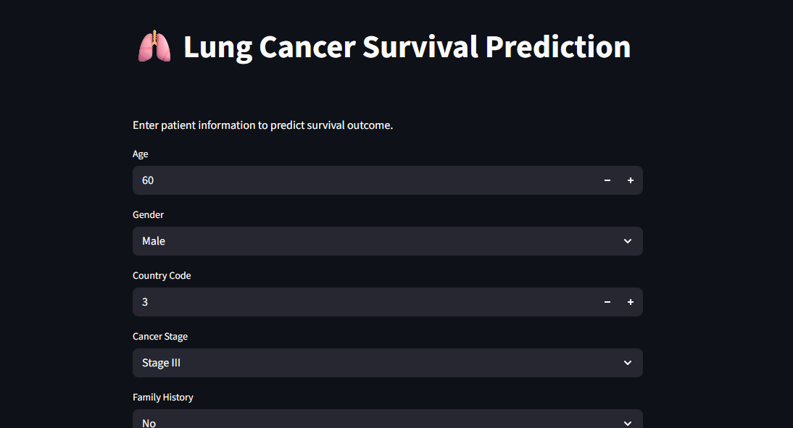

# 🫁 Lung Cancer Survival Prediction System



The Lung Cancer Survival Prediction System is a Machine Learning application that predicts whether a lung cancer patient is likely to survive based on demographic information, medical history, lifestyle factors, and treatment details. The system analyzes patient characteristics such as age, smoking status, cancer stage, BMI, cholesterol level, and treatment type to estimate survival outcomes.

The project uses a Random Forest Classifier trained on a large-scale lung cancer dataset and provides predictions through an interactive Streamlit web application.

## 🎯 Objectives

* Analyze lung cancer patient data using Exploratory Data Analysis (EDA).
* Build a machine learning model for lung cancer survival prediction.
* Evaluate model performance using classification metrics.
* Deploy the model using Streamlit for real-time predictions.

## 📊 Dataset Features

| Feature            | Description                                           |
| ------------------ | ----------------------------------------------------- |
| Age                | Age of the patient                                    |
| Gender             | Gender of the patient                                 |
| Country            | Country or region of residence                        |
| Cancer_Stage       | Stage of lung cancer diagnosis                        |
| Family_History     | Family history of cancer                              |
| Smoking_Status     | Smoking status of the patient                         |
| BMI                | Body Mass Index                                       |
| Cholesterol_Level  | Cholesterol level                                     |
| Hypertension       | Presence of hypertension                              |
| Asthma             | Presence of asthma                                    |
| Cirrhosis          | Presence of liver cirrhosis                           |
| Other_Cancer       | History of another cancer                             |
| Treatment_Type     | Type of treatment received                            |
| Treatment_Duration | Number of days between diagnosis and end of treatment |

### Target Variable

| Variable | Description                    |
| -------- | ------------------------------ |
| Survived | Survival status of the patient |

* 0 = Not Survived
* 1 = Survived

## 🤖 Machine Learning Model

### Model Used

```python
RandomForestClassifier(
    n_estimators=200,
    max_depth=10,
    class_weight="balanced",
    random_state=42
)
```


### Class-wise Performance

```text
Not Survived (Class 0)
Precision = 0.67
Recall = 0.74
F1-Score = 0.71

Survived (Class 1)
Precision = 0.71
Recall = 0.64
F1-Score = 0.67
```

### Key Findings

* The dataset contains approximately 890,000 lung cancer patient records.
* Date features were transformed into treatment duration for better predictive performance.
* Categorical variables were encoded using Label Encoding.
* Cancer stage, age, treatment duration, smoking status, BMI, and cholesterol level were among the most influential features.
* Random Forest achieved balanced performance across both survival classes.
* The model successfully identifies patterns associated with patient survival outcomes.

## 🛠️ Technologies Used

* Python
* Pandas
* NumPy
* Matplotlib
* Seaborn
* Scikit-learn
* Imbalanced-Learn (SMOTE)
* Joblib
* Streamlit

## 📁 Project Structure

```text
Lung Cancer Survival Prediction/
│
├── app.py
├── lung_cancer_model.pkl
├── lung_cancer_encoders.pkl
├── Lungcancer.ipynb
├── lung_cancer.csv
├── requirements.txt
├── README.md
└── Image.png
```

### Clone Repository

```bash
git clone https://github.com/malshiprabodha/Lung-Cancer-Survival-Prediction.git
cd Lung-Cancer-Survival-Prediction
```

### Install Dependencies

```bash
pip install -r requirements.txt
```

### Run Application

```bash
streamlit run app.py
```

## 🌐 Live Demo

```text
https://your-streamlit-app-url.streamlit.app/
```
